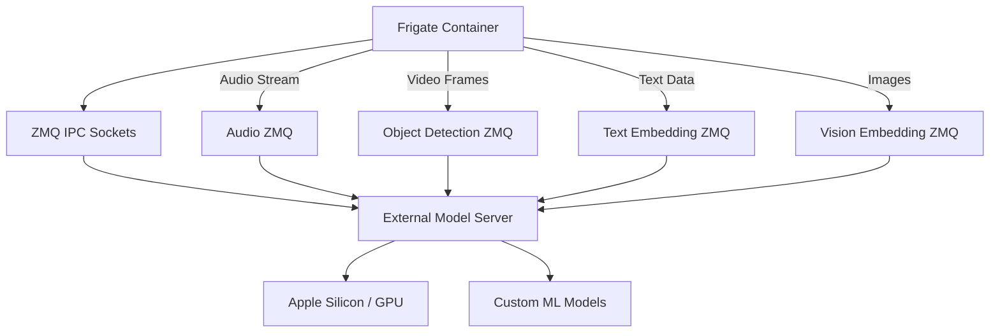

# External Models Framework for Frigate

🚀 **NEW FEATURE**: Run AI models externally on specialized hardware like Apple Silicon neural cores!

## Overview

This feature extends Frigate's existing ZMQ detector pattern to support running different types of AI models outside the Frigate container. This allows you to leverage specialized hardware for better performance and resource management.

## Supported Model Types

✅ **Object Detection** - Enhanced ZMQ detector with new framework  
✅ **Audio Detection** - External audio classification and sound detection  
✅ **Text Embeddings** - External text embedding generation for semantic search  
✅ **Vision Embeddings** - External image embedding generation for semantic search  
🔄 **Face Recognition** - Planned for future release

## Key Benefits

- 🔥 **Performance**: Run models on Apple Silicon, dedicated GPUs, or specialized AI hardware
- 🔧 **Flexibility**: Use any ML framework (CoreML, ONNX, TensorFlow, PyTorch, etc.)
- 📈 **Scalability**: Distribute processing across multiple machines
- 💾 **Resource Management**: Keep Frigate container lightweight and focused
- 🔄 **Backward Compatible**: Existing configurations continue to work unchanged

## Quick Start

### 1. Enable External Models in Frigate Config

```yaml
# Enhanced object detection
detectors:
  zmq_external:
    type: zmq
    use_external_models: true
    endpoint: ipc:///tmp/cache/zmq_detector

# External audio detection
cameras:
  front_door:
    audio:
      enabled: true
      external:
        enabled: true
        endpoint: ipc:///tmp/cache/zmq_audio

# External embeddings for semantic search
semantic_search:
  enabled: true
  external:
    text_enabled: true
    vision_enabled: true
    text_endpoint: ipc:///tmp/cache/zmq_text_embedding
    vision_endpoint: ipc:///tmp/cache/zmq_vision_embedding
```

### 2. Run External Model Server

```bash
# Start the example server (handles all model types)
python example_external_model_server.py

# Or implement your own server for specific hardware
```

### 3. Verify Everything Works

Check Frigate logs for messages like:
- "Using external audio detector for camera_name"
- "Using external text embeddings"
- "Using external vision embeddings"

## Architecture



## External Model Server Protocol

All models use a consistent ZMQ REQ/REP protocol:

### Request Format
```
[header_json][data_bytes]
```

### Header Structure
```json
{
  "model_type": "audio_detection|object_detection|text_embedding|vision_embedding",
  "data_type": "audio|tensor|text|image_batch",
  "shape": [16000],           // For audio/tensor data
  "dtype": "float32",         // For audio/tensor data
  "embedding_dim": 768,       // For embedding models
  "batch_size": 1             // For batch processing
}
```

### Response Format
- **Detection Models**: Raw bytes of float32 array shape (20, 6)
- **Embedding Models**: Raw bytes of float32 embedding vectors

## Implementation Examples

### Apple Silicon with CoreML

```python
import coremltools as ct
from frigate_external_models import BaseExternalServer

class AppleSiliconServer(BaseExternalServer):
    def __init__(self):
        super().__init__()
        # Load CoreML models optimized for Apple Silicon
        self.object_model = ct.models.MLModel('models/yolo_coreml.mlmodel')
        self.audio_model = ct.models.MLModel('models/audio_coreml.mlmodel')
        
    def process_object_detection(self, data):
        # Use Neural Engine for inference
        return self.object_model.predict(data)
```

### GPU Server with ONNX Runtime

```python
import onnxruntime as ort

class GPUServer(BaseExternalServer):
    def __init__(self):
        super().__init__()
        # Use GPU execution provider
        self.providers = ['CUDAExecutionProvider', 'CPUExecutionProvider']
        self.object_session = ort.InferenceSession('models/yolo.onnx', providers=self.providers)
```

## Configuration Options

### Audio Detection

```yaml
cameras:
  camera_name:
    audio:
      external:
        enabled: true
        endpoint: "ipc:///tmp/cache/zmq_audio"
        request_timeout_ms: 300
        linger_ms: 0
```

### Embeddings

```yaml
semantic_search:
  external:
    text_enabled: true
    vision_enabled: true
    text_endpoint: "ipc:///tmp/cache/zmq_text_embedding"
    vision_endpoint: "ipc:///tmp/cache/zmq_vision_embedding"
    text_embedding_dim: 768
    vision_embedding_dim: 768
    request_timeout_ms: 1000
```

### Object Detection

```yaml
detectors:
  zmq:
    type: zmq
    use_external_models: true
    endpoint: "ipc:///tmp/cache/zmq_detector"
    request_timeout_ms: 500
```

## Performance Tuning

### Hardware-Specific Optimizations

- **Apple Silicon**: Use CoreML with Neural Engine
- **NVIDIA GPUs**: Use TensorRT or CUDA
- **Intel**: Use OpenVINO
- **AMD**: Use ROCm

### Timeout Configuration

- **Local IPC**: 200-500ms
- **Network TCP**: 1000-2000ms  
- **Heavy models**: 2000-5000ms

### Batching

Text and vision embeddings support batching for better throughput:

```python
# Process multiple texts at once
texts = ["text1", "text2", "text3"]
embeddings = text_embedding(texts)  # Shape: (3, 768)
```

## Troubleshooting

### Common Issues

1. **Connection Refused**
   - Ensure external server is running
   - Check endpoint URLs match
   - Verify socket permissions

2. **Timeouts**
   - Increase `request_timeout_ms`
   - Check model inference speed
   - Monitor system resources

3. **Wrong Response Format**
   - Verify response data types
   - Check array shapes
   - Validate JSON headers

### Debug Mode

Enable debug logging to see detailed communication:

```python
import logging
logging.getLogger('frigate.external_models').setLevel(logging.DEBUG)
```

## Files Created

- `frigate/external_models/` - Core framework
- `example_external_model_server.py` - Complete example server
- `docs/external_models.md` - Detailed documentation
- `config_example_external_models.yaml` - Example configuration
- `test_external_models_integration.py` - Integration tests

## Backward Compatibility

✅ All existing configurations continue to work  
✅ Gradual migration path available  
✅ Fallback to built-in models when external unavailable  
✅ No breaking changes to existing APIs  

## Future Roadmap

- [ ] Face recognition external processing
- [ ] Model warmup and health checks  
- [ ] Load balancing across multiple servers
- [ ] Authentication and encryption for TCP endpoints
- [ ] Model performance monitoring and metrics

## Contributing

We welcome contributions! Areas where help is needed:

- Hardware-specific optimizations
- Additional model type support
- Performance improvements
- Documentation and examples

## Support

For issues and questions:
1. Check the troubleshooting section
2. Review example configurations
3. Test with the example server
4. Open GitHub issue with logs and config